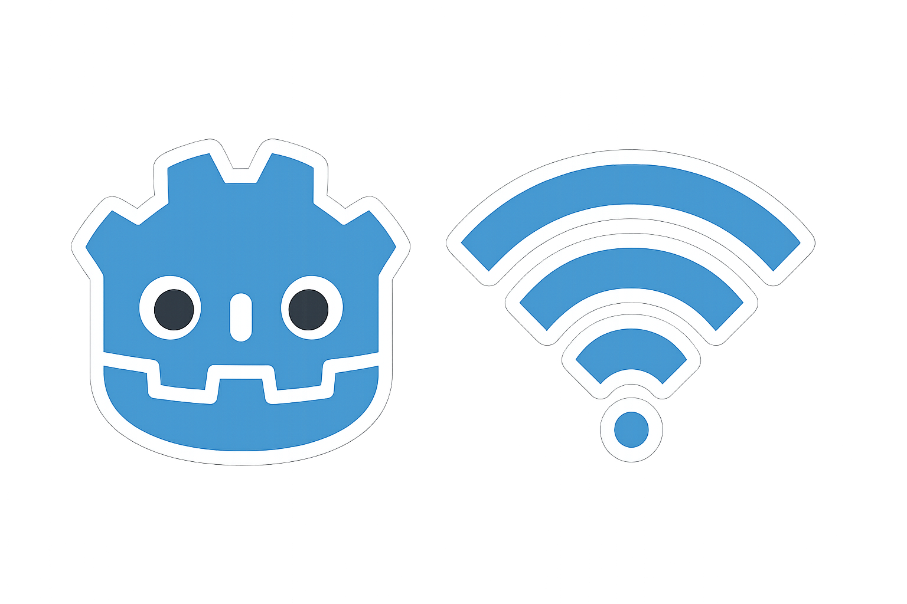

# Godot Multiplayer Template

A simple multiplayer template for Godot 4 where players can move around together in real-time.

## What This Is

This template lets you create a basic multiplayer game where:
- One player can host a game
- Other players can join by entering the host's IP address
- Everyone can move around and see each other moving

## How to Use

### Testing on Your Computer
1. Open the project in Godot 4
2. Export the project as an executable (optional)
3. Run the exported game twice (two windows)
4. In one window, click "Host"
5. In the other window, type "127.0.0.1" and click "Join"
6. Use WASD or arrow keys to move around

### Playing with Friends
1. The host clicks "Host" and shares their IP address
2. Friends enter the host's IP address and click "Join"
3. Everyone can move around together

## What's Included

- **Main Menu**: Simple host/join screen
- **Player Movement**: Move with WASD or arrow keys
- **Multiplayer**: See other players moving in real-time

## Files

- `main_menu.tscn` - The starting menu
- `world.tscn` - The game world where players move
- `player.tscn` - The player character
- Scripts handle the networking and movement

## Controls

- **WASD** or **Arrow Keys** to move

That's it! This template gives you a foundation to build your own multiplayer game on top of.
